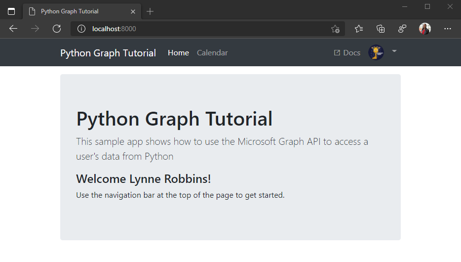

<!-- markdownlint-disable MD002 MD041 -->

In dieser Übung erweitern Sie die Anwendung aus der vorherigen Übung, um die Authentifizierung mit Azure AD zu unterstützen. Dies ist erforderlich, um das erforderliche OAuth-Zugriffstoken zum Aufrufen von Microsoft Graph abzurufen. In diesem Schritt integrieren Sie die [MSAL für Python-Bibliothek](https://github.com/AzureAD/microsoft-authentication-library-for-python) in die Anwendung.

1. Erstellen Sie eine neue Datei im Stammverzeichnis des Projekts namens `oauth_settings.yml` , und fügen Sie den folgenden Inhalt hinzu.

    :::code language="ini" source="../demo/graph_tutorial/oauth_settings.yml.example":::

1. Ersetzen `YOUR_APP_ID_HERE` Sie sie durch die Anwendungs-ID aus dem Anwendungsregistrierungsportal, und ersetzen Sie sie durch das `YOUR_APP_SECRET_HERE` kennwort, das Sie generiert haben.

> [!IMPORTANT]
> Wenn Sie Quellcodeverwaltung wie Git verwenden, wäre es jetzt ein guter Zeitpunkt, die **oauth_settings.yml-Datei** aus der Quellcodeverwaltung auszuschließen, um versehentliches Lecks ihrer App-ID und Ihres Kennworts zu vermeiden.

## <a name="implement-sign-in"></a>Implementieren der Anmeldung

1. Erstellen Sie eine neue Datei im **Verzeichnis ./tutorial** mit dem `auth_helper.py` Namen, und fügen Sie den folgenden Code hinzu.

    :::code language="python" source="../demo/graph_tutorial/tutorial/auth_helper.py" id="FirstCodeSnippet":::

    Diese Datei enthält alle Authentifizierungsmethoden. Der `get_sign_in_flow` generiert eine Autorisierungs-URL, und die `get_token_from_code` Methode tauscht die Autorisierungsantwort gegen ein Zugriffstoken aus.

1. Fügen Sie die folgende `import` Anweisung am oberen Rand von **./tutorial/views.py hinzu.**

    ```python
    from tutorial.auth_helper import get_sign_in_flow, get_token_from_code
    ```

1. Fügen Sie eine Anmeldeansicht in der **Datei ./tutorial/views.py** hinzu.

    :::code language="python" source="../demo/graph_tutorial/tutorial/views.py" id="SignInViewSnippet":::

1. Fügen Sie der Datei **"./tutorial/views.py"** eine Rückrufansicht hinzu.

    ```python
    def callback(request):
      # Make the token request
      result = get_token_from_code(request)
      # Temporary! Save the response in an error so it's displayed
      request.session['flash_error'] = { 'message': 'Token retrieved', 'debug': format(result) }
      return HttpResponseRedirect(reverse('home'))
    ```

    Überlegen Sie, was diese Ansichten tun:

    - Die Aktion generiert die Azure AD-Anmelde-URL, speichert den vom OAuth-Client generierten Fluss und leitet dann den Browser zur `signin` Azure AD-Anmeldeseite um.

    - Die `callback` Aktion leitet Azure um, nachdem die Anmeldung abgeschlossen ist. Diese Aktion verwendet den gespeicherten Fluss und die von Azure gesendete Abfragezeichenfolge, um ein Zugriffstoken ananforderungsen. Anschließend wird die Antwort im temporären Fehlerwert zurück zur Startseite umgeleitet. Damit überprüfen Sie, ob unsere Anmeldung funktioniert, bevor Sie weiter arbeiten.

1. Öffnen **Sie ./tutorial/urls.py,** und ersetzen Sie die vorhandenen `path` Anweisungen durch `signin` Folgendes.

    ```python
    path('signin', views.sign_in, name='signin'),
    ```

1. Fügen Sie ein neues `path` für die Ansicht `callback` hinzu.

    ```python
    path('callback', views.callback, name='callback'),
    ```

1. Starten Sie den Server, und navigieren Sie zu `https://localhost:8000` . Klicken Sie auf die Schaltfläche zum Anmelden, um zu `https://login.microsoftonline.com`weitergeleitet zu werden. Melden Sie sich mit Ihrem Microsoft-Konto an, und stimmen Sie den angeforderten Berechtigungen zu. Der Browser leitet an die App um und zeigt die Antwort an, einschließlich des Zugriffstokens.

### <a name="get-user-details"></a>Benutzerdetails abrufen

1. Erstellen Sie eine neue Datei im **Verzeichnis ./tutorial** mit dem `graph_helper.py` Namen, und fügen Sie den folgenden Code hinzu.

    :::code language="python" source="../demo/graph_tutorial/tutorial/graph_helper.py" id="FirstCodeSnippet":::

    Die Methode stellt eine GET-Anforderung an den Microsoft Graph-Endpunkt, um das Profil des Benutzers mithilfe des zuvor erworbenen `get_user` `/me` Zugriffstokens abzurufen.

1. Aktualisieren Sie `callback` die Methode in **./tutorial/views.py,** um das Profil des Benutzers aus Microsoft Graph zu erhalten. Fügen Sie die folgende `import`-Anweisung zum Anfang der Datei hinzu.

    ```python
    from tutorial.graph_helper import *
    ```

1. Ersetzen Sie die `callback`-Methode durch den folgenden Code.

    ```python
    def callback(request):
      # Make the token request
      result = get_token_from_code(request)

      #Get the user's profile
      user = get_user(result['access_token'])
      # Temporary! Save the response in an error so it's displayed
      request.session['flash_error'] = { 'message': 'Token retrieved', 'debug': 'User: {0}\nToken: {1}'.format(user, result) }
      return HttpResponseRedirect(reverse('home'))
    ```

    Der neue Code ruft die `get_user` Methode zum Anfordern des Benutzerprofils auf. Das Benutzerobjekt wird der temporären Ausgabe zu Testzwecken hinzufügt.

1. Fügen Sie die folgenden neuen Methoden zu **./tutorial/auth_helper.py hinzu.**

    :::code language="python" source="../demo/graph_tutorial/tutorial/auth_helper.py" id="SecondCodeSnippet":::

1. Aktualisieren Sie `callback` die Funktion in **./tutorial/views.py,** um den Benutzer in der Sitzung zu speichern und zurück zur Hauptseite umzuleiten. Ersetzen Sie `from tutorial.auth_helper import get_sign_in_flow, get_token_from_code` die Zeile durch Folgendes.

    ```python
    from tutorial.auth_helper import get_sign_in_flow, get_token_from_code, store_user, remove_user_and_token, get_token
    ```

1. Ersetzen Sie `callback` die Methode durch Folgendes.

    :::code language="python" source="../demo/graph_tutorial/tutorial/views.py" id="CallbackViewSnippet":::

## <a name="implement-sign-out"></a>Implementieren des Abmeldens

1. Fügen Sie eine neue `sign_out` Ansicht in **./tutorial/views.py hinzu.**

    :::code language="python" source="../demo/graph_tutorial/tutorial/views.py" id="SignOutViewSnippet":::

1. Öffnen **Sie ./tutorial/urls.py,** und ersetzen Sie die vorhandenen `path` Anweisungen durch `signout` Folgendes.

    ```python
    path('signout', views.sign_out, name='signout'),
    ```

1. Starten Sie den Server neu, und gehen Sie den Anmeldevorgang durch. Sie sollten wieder auf der Startseite landen, aber die Benutzeroberfläche sollte geändert werden, um anzugeben, dass Sie angemeldet sind.

    

1. Klicken Sie in der oberen rechten Ecke auf den Avatar des Benutzers, um auf den Link **"Abmelden" zu** klicken. Wenn Sie auf **Abmelden** klicken, wird die Sitzung zurückgesetzt und Sie kehren zur Startseite zurück.

    

## <a name="refreshing-tokens"></a>Aktualisieren von Token

An diesem Punkt verfügt Ihre Anwendung über ein Zugriffstoken, das im `Authorization` Header von API-Aufrufen gesendet wird. Dies ist das Token, mit dem die App im Namen des Benutzers auf Microsoft Graph zugreifen kann.

Dieses Token ist jedoch nur kurzzeitig verfügbar. Das Token läuft eine Stunde nach seiner Entsprechung ab. An dieser Stelle kommt das Aktualisierungstoken ins Spiel. Anhand des Aktualisierungstoken ist die App in der Lage, ein neues Zugriffstoken anzufordern, ohne dass der Benutzer sich erneut anmelden muss.

Da in diesem Beispiel MSAL verwendet wird, müssen Sie keinen bestimmten Code schreiben, um das Token zu aktualisieren. Die Methode von MSAL `acquire_token_silent` behandelt bei Bedarf das Aktualisieren des Tokens.
