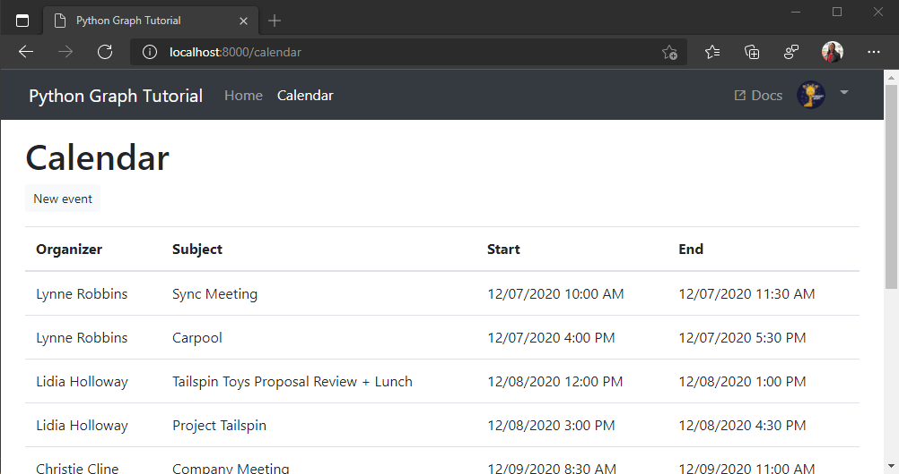

<!-- markdownlint-disable MD002 MD041 -->

<span data-ttu-id="efce7-101">In dieser Übung werden Sie das Microsoft Graph in die Anwendung integrieren.</span><span class="sxs-lookup"><span data-stu-id="efce7-101">In this exercise you will incorporate the Microsoft Graph into the application.</span></span> <span data-ttu-id="efce7-102">Für diese Anwendung verwenden Sie die Requests [-OAuthlib-](https://requests-oauthlib.readthedocs.io/en/latest/) Bibliothek, um Anrufe an Microsoft Graph zu tätigen.</span><span class="sxs-lookup"><span data-stu-id="efce7-102">For this application, you will use the [Requests-OAuthlib](https://requests-oauthlib.readthedocs.io/en/latest/) library to make calls to Microsoft Graph.</span></span>

## <a name="get-calendar-events-from-outlook"></a><span data-ttu-id="efce7-103">Abrufen von Kalenderereignissen aus Outlook</span><span class="sxs-lookup"><span data-stu-id="efce7-103">Get calendar events from Outlook</span></span>

<span data-ttu-id="efce7-104">Beginnen Sie mit dem Hinzufügen `./tutorial/graph_helper.py` einer Methode zum Abrufen der Kalenderereignisse.</span><span class="sxs-lookup"><span data-stu-id="efce7-104">Start by adding a method to `./tutorial/graph_helper.py` to fetch the calendar events.</span></span> <span data-ttu-id="efce7-105">Fügen Sie die folgende Methode hinzu.</span><span class="sxs-lookup"><span data-stu-id="efce7-105">Add the following method.</span></span>

```python
def get_calendar_events(token):
  graph_client = OAuth2Session(token=token)

  # Configure query parameters to
  # modify the results
  query_params = {
    '$select': 'subject,organizer,start,end',
    '$orderby': 'createdDateTime DESC'
  }

  # Send GET to /me/events
  events = graph_client.get('{0}/me/events'.format(graph_url), params=query_params)
  # Return the JSON result
  return events.json()
```

<span data-ttu-id="efce7-106">Überprüfen Sie, was dieser Code tut.</span><span class="sxs-lookup"><span data-stu-id="efce7-106">Consider what this code is doing.</span></span>

- <span data-ttu-id="efce7-107">Die URL, die aufgerufen wird `/v1.0/me/events`.</span><span class="sxs-lookup"><span data-stu-id="efce7-107">The URL that will be called is `/v1.0/me/events`.</span></span>
- <span data-ttu-id="efce7-108">Der `$select` Parameter schränkt die für die einzelnen Ereignisse zurückgegebenen Felder auf diejenigen ein, die von der Ansicht tatsächlich verwendet werden.</span><span class="sxs-lookup"><span data-stu-id="efce7-108">The `$select` parameter limits the fields returned for each events to just those the view will actually use.</span></span>
- <span data-ttu-id="efce7-109">Der `$orderby` Parameter sortiert die Ergebnisse nach dem Datum und der Uhrzeit, zu der Sie erstellt wurden, wobei das letzte Element zuerst angezeigt wird.</span><span class="sxs-lookup"><span data-stu-id="efce7-109">The `$orderby` parameter sorts the results by the date and time they were created, with the most recent item being first.</span></span>

<span data-ttu-id="efce7-110">Erstellen Sie jetzt eine Kalenderansicht.</span><span class="sxs-lookup"><span data-stu-id="efce7-110">Now create a calendar view.</span></span> <span data-ttu-id="efce7-111">Ändern `./tutorial/views.py`Sie in zunächst die `from tutorial.graph_helper import get_user` -Reihe in die folgende.</span><span class="sxs-lookup"><span data-stu-id="efce7-111">In `./tutorial/views.py`, first change the `from tutorial.graph_helper import get_user` line to the following.</span></span>

```python
from tutorial.graph_helper import get_user, get_calendar_events
```

<span data-ttu-id="efce7-112">Fügen Sie dann die folgende Ansicht zu `./tutorial/views.py`hinzu.</span><span class="sxs-lookup"><span data-stu-id="efce7-112">Then, add the following view to `./tutorial/views.py`.</span></span>

```python
def calendar(request):
  context = initialize_context(request)

  token = get_token(request)

  events = get_calendar_events(token)

  context['errors'] = [
    { 'message': 'Events', 'debug': format(events)}
  ]

  return render(request, 'tutorial/home.html', context)
```

<span data-ttu-id="efce7-113">Aktualisieren `./tutorial/urls.py` , um diese neue Ansicht hinzuzufügen.</span><span class="sxs-lookup"><span data-stu-id="efce7-113">Update `./tutorial/urls.py` to add this new view.</span></span>

```python
path('calendar', views.calendar, name='calendar'),
```

<span data-ttu-id="efce7-114">Aktualisieren Sie schließlich den **Kalender** Link in `./tutorial/templates/tutorial/layout.html` , um eine Verknüpfung mit dieser Ansicht aufzurufen.</span><span class="sxs-lookup"><span data-stu-id="efce7-114">Finally, update  the **Calendar** link in `./tutorial/templates/tutorial/layout.html` to link to this view.</span></span> <span data-ttu-id="efce7-115">Ersetzen Sie `<a class="nav-link active" href="#">Calendar</a>` die-Verbindung durch Folgendes.</span><span class="sxs-lookup"><span data-stu-id="efce7-115">Replace the `<a class="nav-link active" href="#">Calendar</a>` line with the following.</span></span>

```html
<a class="nav-link active" href="">Calendar</a>
```

<span data-ttu-id="efce7-116">Nun können Sie dies testen.</span><span class="sxs-lookup"><span data-stu-id="efce7-116">Now you can test this.</span></span> <span data-ttu-id="efce7-117">Melden Sie sich an, und klicken Sie in der Navigationsleiste auf den Link **Kalender** .</span><span class="sxs-lookup"><span data-stu-id="efce7-117">Sign in and click the **Calendar** link in the nav bar.</span></span> <span data-ttu-id="efce7-118">Wenn alles funktioniert, sollte ein JSON-Abbild der Ereignisse im Kalender des Benutzers angezeigt werden.</span><span class="sxs-lookup"><span data-stu-id="efce7-118">If everything works, you should see a JSON dump of events on the user's calendar.</span></span>

## <a name="display-the-results"></a><span data-ttu-id="efce7-119">Anzeigen der Ergebnisse</span><span class="sxs-lookup"><span data-stu-id="efce7-119">Display the results</span></span>

<span data-ttu-id="efce7-120">Jetzt können Sie eine Vorlage hinzufügen, um die Ergebnisse auf eine benutzerfreundlichere Weise anzuzeigen.</span><span class="sxs-lookup"><span data-stu-id="efce7-120">Now you can add a template to display the results in a more user-friendly manner.</span></span> <span data-ttu-id="efce7-121">Erstellen Sie eine neue Datei im `./tutorial/templates/tutorial` Verzeichnis mit `calendar.html` dem Namen, und fügen Sie den folgenden Code hinzu.</span><span class="sxs-lookup"><span data-stu-id="efce7-121">Create a new file in the `./tutorial/templates/tutorial` directory named `calendar.html` and add the following code.</span></span>

```html


<h1>Calendar</h1>
<table class="table">
  <thead>
    <tr>
      <th scope="col">Organizer</th>
      <th scope="col">Subject</th>
      <th scope="col">Start</th>
      <th scope="col">End</th>
    </tr>
  </thead>
  <tbody>
    
      
        <tr>
          <td>{{ event.organizer.emailAddress.name }}</td>
          <td>{{ event.subject }}</td>
          <td>{{ event.start.dateTime|date:'SHORT_DATETIME_FORMAT' }}</td>
          <td>{{ event.end.dateTime|date:'SHORT_DATETIME_FORMAT' }}</td>
        </tr>
      
    
  </tbody>
</table>

```

<span data-ttu-id="efce7-122">Dadurch wird eine Auflistung von Ereignissen durchlaufen und für jeden eine Tabellenzeile hinzugefügt.</span><span class="sxs-lookup"><span data-stu-id="efce7-122">That will loop through a collection of events and add a table row for each one.</span></span> <span data-ttu-id="efce7-123">Fügen Sie die `import` folgende Anweisung am Anfang der `./tutorials/views.py` Datei hinzu.</span><span class="sxs-lookup"><span data-stu-id="efce7-123">Add the following `import` statement to the top of the `./tutorials/views.py` file.</span></span>

```python
import dateutil.parser
```

<span data-ttu-id="efce7-124">Ersetzen Sie `calendar` die Ansicht `./tutorial/views.py` in durch den folgenden Code.</span><span class="sxs-lookup"><span data-stu-id="efce7-124">Replace the `calendar` view in `./tutorial/views.py` with the following code.</span></span>

```python
def calendar(request):
  context = initialize_context(request)

  token = get_token(request)

  events = get_calendar_events(token)

  if events:
    # Convert the ISO 8601 date times to a datetime object
    # This allows the Django template to format the value nicely
    for event in events['value']:
      event['start']['dateTime'] = dateutil.parser.parse(event['start']['dateTime'])
      event['end']['dateTime'] = dateutil.parser.parse(event['end']['dateTime'])

    context['events'] = events['value']

  return render(request, 'tutorial/calendar.html', context)
```

<span data-ttu-id="efce7-125">Aktualisieren Sie die Seite, und die APP sollte jetzt eine Tabelle mit Ereignissen rendern.</span><span class="sxs-lookup"><span data-stu-id="efce7-125">Refresh the page and the app should now render a table of events.</span></span>


